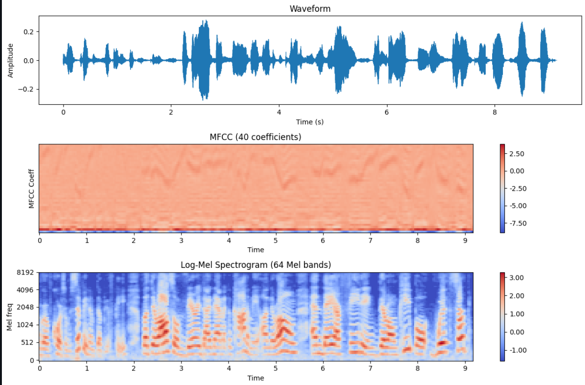
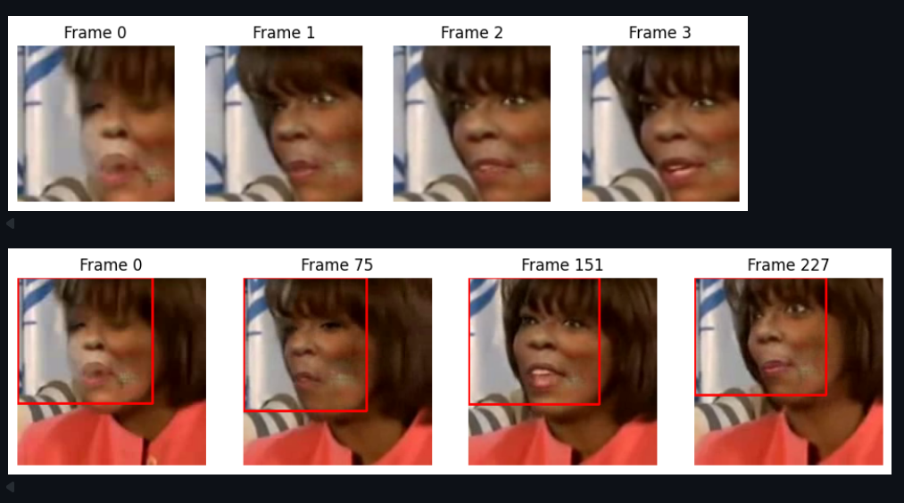
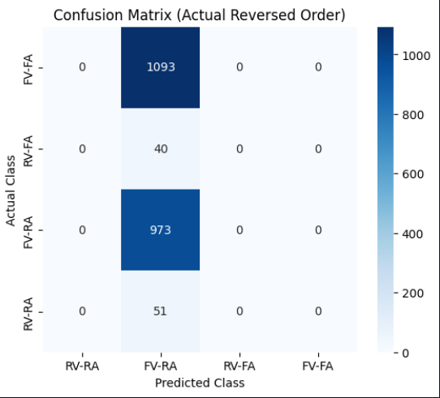
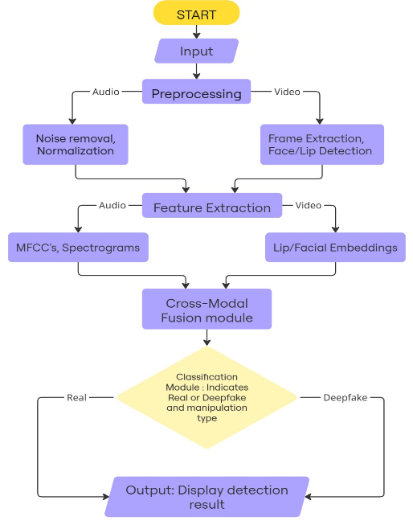

# Cross-Modal-Deepfake-Detection-through-Audio-Video-Analysis

## 📌 Overview
A cross-modal deepfake detection system that analyzes both speech and lip movements to identify manipulated audio-visual content. Unlike traditional methods that focus only on one modality, this project combines audio and video analysis for more accurate, robust, and real-time detection.

---

## 🎧 Audio Feature Extraction

### **Waveform, MFCC (40 coefficients), and Log-Mel Spectrogram**

---

## 🎥 Video Frame Extraction & Face Tracking

### **Initial Extracted Frames**

---

## 📊 Model Evaluation

### **Confusion Matrix**

---

## 🎯 Objectives  
- Develop a **cross-modal detection system** that jointly analyzes audio and video.  
- Improve detection accuracy by focusing on **deepfake audio** through speech feature extraction.  
- Enhance existing methods by identifying subtle discrepancies in both modalities.  
- Build a **user-friendly interface** to visualize and demonstrate detection results.

---

## 🛠️ Tech Stack & Requirements  

### Programming Language  
- **Python 3.10+** – Main language for development and ML model implementation  

### Deep Learning Frameworks  
- **PyTorch 2.0** / **TensorFlow 2.15** / **Keras 2.12** – For building and training detection models  

### Data Processing & Visualization  
- **NumPy** – Numerical computations  
- **Pandas** – Data manipulation  
- **Matplotlib** / **Seaborn** – Visualizations and plots  

### Audio & Video Processing  
- **OpenCV 4.8+** – Video/frame extraction and preprocessing  
- **Librosa 0.10+** – Audio feature extraction (MFCC, spectrograms)  

### Machine Learning Utilities  
- **Scikit-learn 1.3+** – Feature scaling, evaluation metrics, and auxiliary ML models  

--- 

## 📊 Project Flow

---

### 📽️ Project Introduction Video  
👉 [Click here to watch/download the video](https://github.com/aman007j/Cross-Modal-Deepfake-Detection-through-Audio-Video-Analysis/releases/tag/Video/CrossModelDeepfakeDetection.mp4
)

---

## 📜 License  
This project is licensed under the **MIT License** – see the [LICENSE](LICENSE) file for details.

---

## 👨‍💻 Contributors  
- Priyal Sharma (221030444)
- Aman Jain (221031060)  
- Rishav Rana (221030301)
- Chetanya Baliyan (221030137)  
